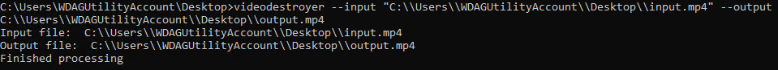

# VideoDestroyer
absolutely destroy the quality of video files. infinite entertainment!

## installation 
- get [ffmpeg](https://github.com/BtbN/FFmpeg-Builds/releases/download/latest/ffmpeg-master-latest-win64-gpl.zip) and either add it to your PATH or put it in the same directory as the executable
- download the executable from the [releases](https://github.com/artificialbutter/VideoDestroyer/releases/) page
- run the executable from the command line  
example command (Command Prompt): `videodestroyer --input C:\\Users\\Artificial\\Documents\\Coding\\JS\\VideoDestroyer\\input.mp4  --output C:\\Users\\Artificial\\Documents\\Coding\\JS\\VideoDestroyer\\output.mp4`

better README.md coming soon if i feel like it